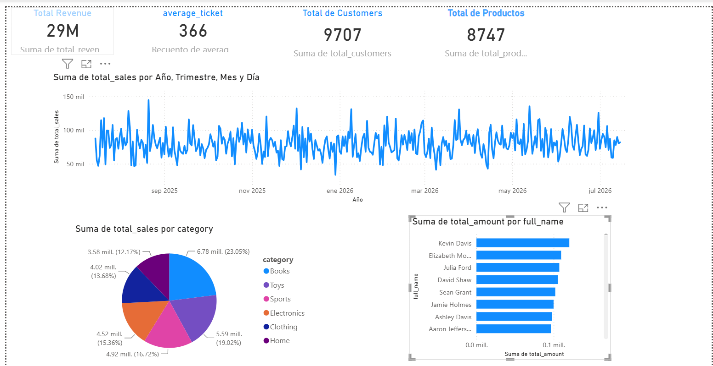

# TrabajoFinalAzureDatabricks V1.0

##########################################################################
PASO 1. CAPA BRONZE 
##########################################################################
rchivos de entrada

El notebook carga los siguientes archivos CSV:
-----------------------------------------------
customers.csv
products.csv
sales.csv
branches.csv
employees.csv
Tablas generadas

Cada archivo CSV se carga en una tabla Delta de la capa Bronze.
-----------------------------------------------------------------
Archivo CSV	Tabla Bronze
customers.csv	customers_raw
products.csv	products_raw
sales.csv	sales_raw
branches.csv	branches_raw
employees.csv	employees_raw
Procesos realizados
Lectura de archivos

Cada archivo CSV es leído utilizando Apache Spark con detección automática del esquema y encabezados.

Validación básica
-----------------------------
Durante la carga se verifica:

Existencia del archivo.
Lectura correcta del esquema.
Cantidad de registros cargados.
Incorporación de metadatos

Antes de almacenar la información se agrega una columna técnica:

ingestion_timestamp
-----------------------
Esta columna registra la fecha y hora en que los datos fueron cargados en la capa Bronze, permitiendo llevar un control de las ingestas.

Almacenamiento
--------------------
Los datos son almacenados como tablas Delta Lake utilizando el modo de sobrescritura (overwrite), lo que facilita la administración y actualización de la información.

Salida
------------
El notebook genera las siguientes tablas Delta en el esquema Bronze:

customers_raw
products_raw
sales_raw
branches_raw
employees_raw
Beneficios

Al finalizar el proceso, la información queda:

Almacenada en formato Delta Lake.
Conservada en su estado original.
Lista para ser transformada en la capa Silver.
Con trazabilidad mediante la marca de tiempo de ingesta.

#########################################################################
PASO 2. CAPA SILVER 
##########################################################################
Transformaciones realizadas
Customers
----------
Eliminación de registros duplicados.
Conversión del correo electrónico a minúsculas.
Eliminación de espacios en blanco.
Creación del campo full_name a partir del nombre y apellido.

Products
---------
Eliminación de productos con precio menor o igual a cero.
Eliminación de registros con stock negativo.
Normalización de categorías.
Normalización de marcas.

Branches
-----------
Eliminación de sucursales duplicadas.
Estandarización del nombre de la sucursal.
Normalización del nombre de la ciudad.

Employees
------------
Eliminación de registros duplicados.
Creación del campo full_name.
Conservación de la relación con la sucursal correspondiente.

Sales
-------------
Durante la transformación se calculan nuevos indicadores de negocio.
Se obtiene el subtotal:
subtotal = quantity × unit_price
Posteriormente se calcula el total considerando el descuento aplicado:
total = subtotal − (subtotal × discount)

También se validan:
Cantidad mayor que cero.
Precio unitario mayor que cero.

Salida
El notebook genera las siguientes tablas Delta en el esquema silver:

customers
products
branches
employees
sales
Beneficios

Al finalizar el proceso, la información queda:

Limpia.
Normalizada.
Libre de duplicados.
Lista para análisis.
Preparada para la generación de indicadores de negocio.

####################################################################
PASO 3. CAPA GOLD 
####################################################################

Tablas de entrada

El notebook utiliza las siguientes tablas de la capa Silver:

customers
products
sales
Tablas generadas
1. sales_summary

Genera un resumen diario de ventas.

Calcula:

Total de ventas.
Número de transacciones.
Ticket promedio por día.

Esta tabla permite analizar la evolución diaria de las ventas.

2. sales_by_city

Relaciona las ventas con los clientes para obtener indicadores por ciudad.

Calcula:

Total vendido por ciudad.
Número de transacciones por ciudad.

Permite identificar las ciudades con mayor volumen de ventas.

3. sales_by_category

Relaciona las ventas con los productos.

Calcula:

Total vendido por categoría.
Número de ventas por categoría.

Facilita el análisis del desempeño de cada línea de productos.

4. top_customers

Genera un ranking de clientes.

Calcula para cada cliente:

Monto total comprado.
Número de compras realizadas.

La información se ordena de mayor a menor monto de compra.

5. top_products

Genera un ranking de productos.

Calcula:

Unidades vendidas.
Total vendido por producto.

Permite identificar los productos con mayor demanda.

6. kpi_dashboard

Construye una tabla de indicadores (KPIs) para consumo directo por un dashboard.

Calcula diariamente:

Ingresos totales.
Número de clientes únicos.
Número de productos vendidos.
Ticket promedio.
Salida

El notebook genera las siguientes tablas Delta en el esquema Gold:

sales_summary
sales_by_city
sales_by_category
top_customers
top_products
kpi_dashboard
Beneficios

Al finalizar el proceso, la información queda:

Agregada para análisis de negocio.
Optimizada para consultas analíticas.
Lista para herramientas de visualización.
Preparada para la construcción de dashboards e indicadores ejecutivos.

#########################################################################################
DASHBOARD
##########################################################################################

## Dashboard

El dashboard final construido en Power BI muestra los principales KPI de ventas.

##############################################################################################
REVERSIONES 
###############################################################################################

Orden de ejecución

1. 01_drop_gold.sql
2. 02_drop_silver.sql
3. 03_drop_bronze.sql
4. 04_drop_schemas.sql
5. 05_drop_catalog.sql

Estos scripts permiten eliminar el entorno de manera segura respetando las dependencias entre objetos.

#################################################################################################
SEGURIDAD 
################################################################################################

01_Create_Groups.py       : Creación de grupos de usuarios.
02_Grant_Permissions.py   : Asignación de permisos en Unity Catalog.
03_Row_Level_Security.py  : Ejemplo de seguridad a nivel de filas.
04_Audit_Permissions.py   : Auditoría de permisos sobre objetos .
05_Data_Access_Report.py  : Reporte consolidado de accesos y permisos.

##################################################################################################
LLEVAR del ENTORNO PREPRODUCTIVO a PRODUCCION .
##################################################################################################

Con el archivo deploy-explorer.yml se llevan los archivos .py de PRE hacia PROD 
